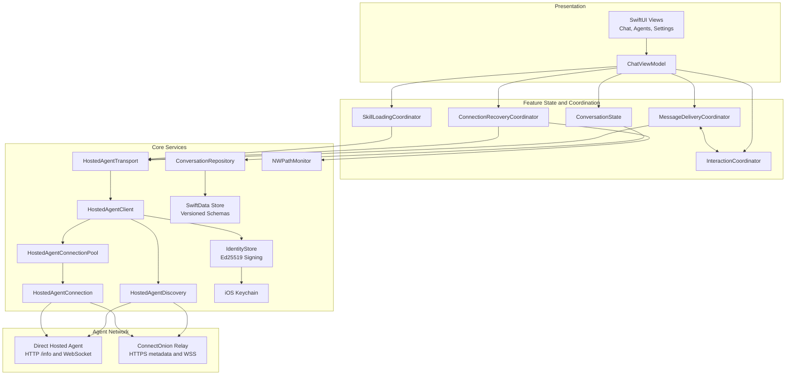

# OOChatIOS

OOChatIOS is a native SwiftUI client for connecting to and chatting with
[ConnectOnion](https://github.com/openonion) hosted agents. It discovers local or
remote agents, establishes signed WebSocket sessions, renders streamed Markdown
responses, and keeps conversations available on device.

## Features

- Manage multiple hosted agents by Ed25519 address.
- Add agents manually or by scanning a QR code, and share saved agents as QR codes.
- Discover nearby agent endpoints first, with automatic fallback to the ConnectOnion relay.
- Stream agent responses, thinking updates, tool calls, and tool results.
- Support Safe, Plan, Accept Edits, and Ultra Work chat modes.
- Handle tool approvals, plan reviews, agent questions, and Ultra Work checkpoints in the chat.
- Attach up to 10 images and 10 files per message, with a 10 MB limit per attachment.
- Dictate prompts with on-device microphone and speech-recognition integration.
- Render Markdown, syntax-highlighted code blocks, and structured tool activity.
- Persist agents, conversations, messages, attachments, and session state with SwiftData.
- Search conversation titles and message content.
- Queue, retry, or cancel message delivery when connectivity changes.
- Reuse WebSocket sessions through a bounded connection pool.
- Follow system appearance or use an explicit light or dark theme.

## Requirements

- macOS with Xcode 26 and an iOS Simulator runtime installed
- iOS 17.0 or later
- Python 3.10 or later for the automated setup script
- Network access for Swift Package Manager and remote hosted agents

The project was created with Xcode 26 and is validated in CI on macOS 26. Its
deployment target is iOS 17.0.

## Getting Started

Open a terminal in the repository root and run:

```bash
./scripts/setup.sh
```

The setup script:

1. Validates Xcode, Python, and Simulator tooling.
2. Selects and boots an available iPhone Simulator running iOS 17 or later.
3. Resolves Swift Package Manager dependencies during the build.
4. Builds, installs, and launches OOChatIOS.

To target a particular simulator:

```bash
SIMULATOR_NAME="iPhone 17" ./scripts/setup.sh
```

You can also select a device by UDID or customise the build location:

```bash
SIMULATOR_UDID="<simulator-udid>" \
DERIVED_DATA_PATH="/tmp/OOChatIOSDerivedData" \
SKIP_OPEN_SIMULATOR=1 \
./scripts/setup.sh
```

For manual development, open `OOChatIOS.xcodeproj`, select the `OOChatIOS`
scheme and an iOS 17+ device, then run the app.

## Connecting to an Agent

1. Open the agent sidebar and choose **Add Agent**.
2. Enter a hosted-agent address or scan an agent QR code.
3. Save the agent and start a new conversation.
4. Choose a chat mode, enter a prompt, and send it.

A valid hosted-agent address is a `0x`-prefixed, 32-byte Ed25519 public key:

```text
0x<64 hexadecimal characters>
```

The client probes local development endpoints at `localhost:8000` and
`127.0.0.1:8000`, checks endpoints advertised by the relay, and otherwise uses
`wss://oo.openonion.ai/ws/input`.

The Simulator can be used for normal chat development. QR scanning requires a
supported physical device and camera access. Voice input requires microphone and
speech-recognition permission.

## Architecture

The application uses a view-model and coordinator-based architecture. SwiftUI
views observe a main-actor `ChatViewModel`; focused coordinators own message
delivery, recovery, skill loading, and interactive agent requests. Protocols
separate those features from transport and persistence implementations.



### Message Lifecycle

1. `ChatViewModel` validates the prompt and attachments, then asks
   `MessageDeliveryCoordinator` to enqueue the user message.
2. `HostedAgentClient` discovers the best route and obtains or creates a pooled
   `HostedAgentConnection`.
3. `IdentityStore` signs canonical `CONNECT` and `INPUT` payloads with the
   device's Ed25519 identity.
4. The connection streams output and tool events back into the active
   conversation.
5. Interactive events pause the agent turn until `InteractionCoordinator`
   returns the user's approval, plan decision, checkpoint choice, or answer.
6. Conversation changes are written incrementally through
   `ConversationRepository` to SwiftData.
7. If the network drops, queued messages remain local and recovery logic retries
   the relevant session after connectivity returns.

## Technology Stack

| Area | Technology |
| --- | --- |
| User interface | SwiftUI |
| Language | Swift 5 |
| Minimum platform | iOS 17.0 |
| State management | `ObservableObject`, Combine, Swift concurrency |
| Persistence | SwiftData with versioned schema migrations |
| Realtime transport | `URLSessionWebSocketTask` |
| Endpoint discovery | `URLSession` HTTP requests and relay metadata |
| Identity and signing | CryptoKit Ed25519 and iOS Keychain |
| Connectivity | Network framework |
| QR scanning | VisionKit and AVFoundation |
| Voice input | Speech and AVFoundation |
| Markdown rendering | MarkdownUI 2.4.1 or later within the 2.x range |
| Testing | XCTest |
| Quality checks | SwiftLint, code coverage, Trivy |

## Project Structure

```text
OOChatIOS/
├── App/                    Application entry point, root view, and appearance
├── Core/
│   ├── Identity/           Device identity and Ed25519 signing
│   ├── Models/             Shared domain models
│   ├── Network/            Connectivity monitoring
│   ├── Persistence/        SwiftData repository, schemas, and migrations
│   ├── Protocol/           Discovery, WebSocket protocol, and connection pool
│   └── Utilities/          Canonical encoding helpers
├── Features/
│   ├── Agents/             Agent forms and QR-code workflows
│   ├── Chat/               Chat UI, state, delivery, and interaction handling
│   └── Settings/           Appearance, identity, and session controls
├── Resources/              Asset catalog and application property list
└── Shared/                 Theme and reusable UI components

OOChatIOSTests/              Unit, component, recovery, and journey tests
scripts/                     Local setup and coverage scripts
.github/workflows/           CI and security scanning
```

The Git submodules under `submodules/` contain related ConnectOnion reference
implementations. They are not required to build the iOS target.

## Building and Testing

Build from the command line:

```bash
xcodebuild build \
  -project OOChatIOS.xcodeproj \
  -scheme OOChatIOS \
  -configuration Debug \
  -sdk iphonesimulator \
  -destination 'platform=iOS Simulator,name=iPhone 17,OS=latest'
```

Run the test suite with coverage:

```bash
xcodebuild test \
  -project OOChatIOS.xcodeproj \
  -scheme OOChatIOS \
  -configuration Debug \
  -sdk iphonesimulator \
  -destination 'platform=iOS Simulator,name=iPhone 17,OS=latest' \
  -parallel-testing-enabled NO \
  -enableCodeCoverage YES \
  -resultBundlePath build/TestResults.xcresult \
  -derivedDataPath build/DerivedData
```

Enforce the same line-coverage gate used by CI:

```bash
./scripts/check_coverage.sh build/TestResults.xcresult 70 OOChatIOS.app
```

The coverage check requires line coverage to be strictly greater than 70%.

Run linting with the repository configuration:

```bash
swiftlint lint --config .swiftlint.yml
```

CI runs SwiftLint 0.63.2, the complete test suite with coverage, and a Trivy scan
for vulnerable dependencies, exposed secrets, and configuration issues.

## Data and Security

- The app creates a per-installation Ed25519 private key and stores it in the
  Keychain with `ThisDeviceOnly` accessibility.
- The agent address is derived from the corresponding public key.
- Session requests sign canonical payloads; attachment contents are represented
  by a canonical SHA-256 digest in the signed input metadata.
- Agents, conversations, messages, attachment data, and resumable server session
  state are stored locally with SwiftData.
- If the persistent store cannot be opened, the app falls back to in-memory
  storage for the current session and surfaces the persistence error.
- Local-network access is allowed for agent discovery, while arbitrary network
  loads remain disabled.
- Never commit local keys, secrets, `.env` files, or the ignored `.co/`
  directory.

## Continuous Integration

Two GitHub Actions workflows run for pushes and pull requests:

- `iOS CI` performs strict SwiftLint checks, runs tests, enforces coverage, and
  uploads test artifacts.
- `Security` scans the repository with Trivy and also runs on a weekly schedule.
