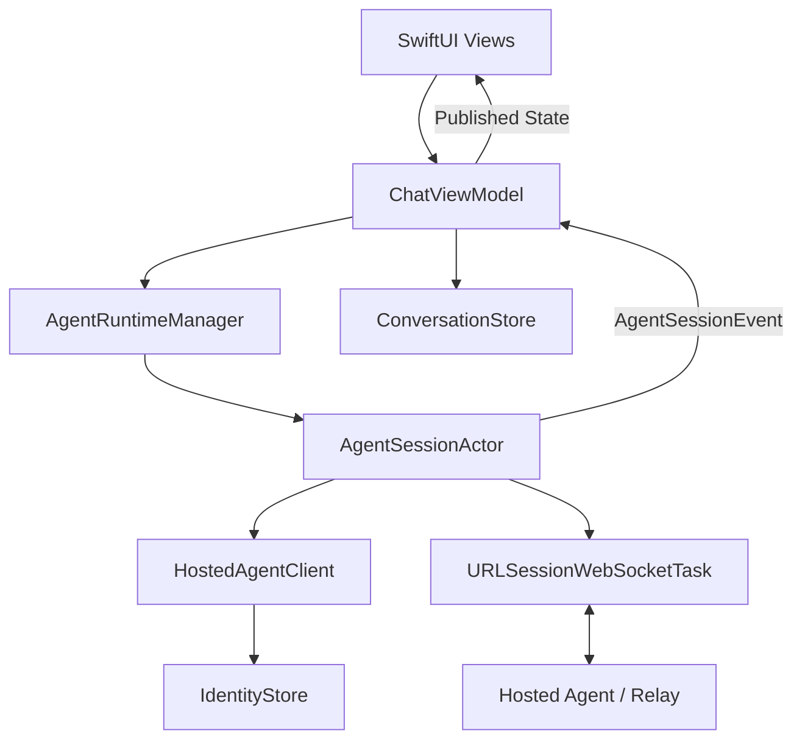
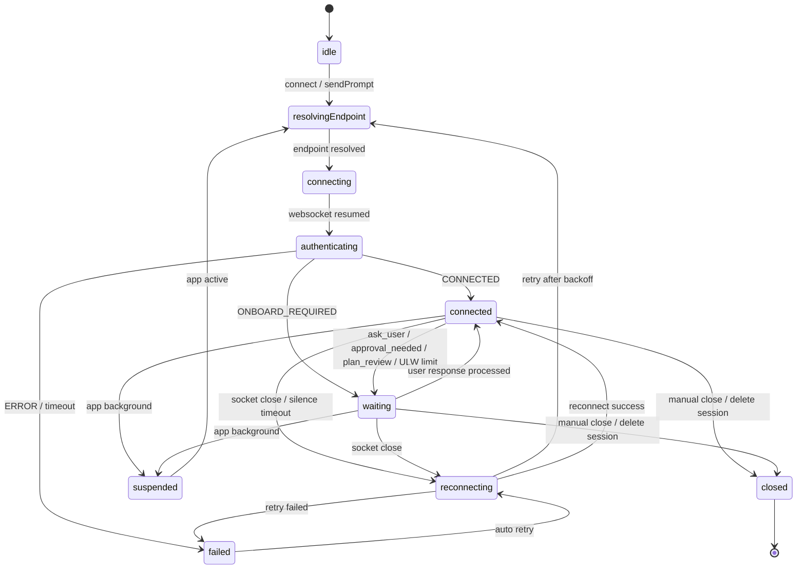
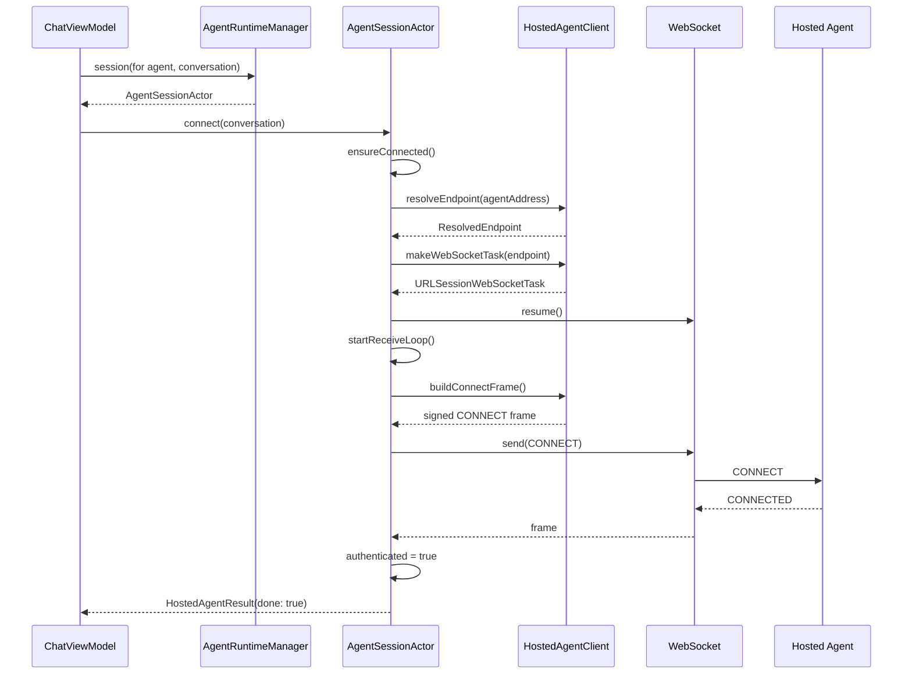
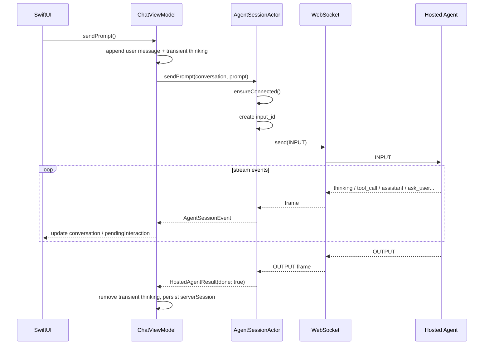
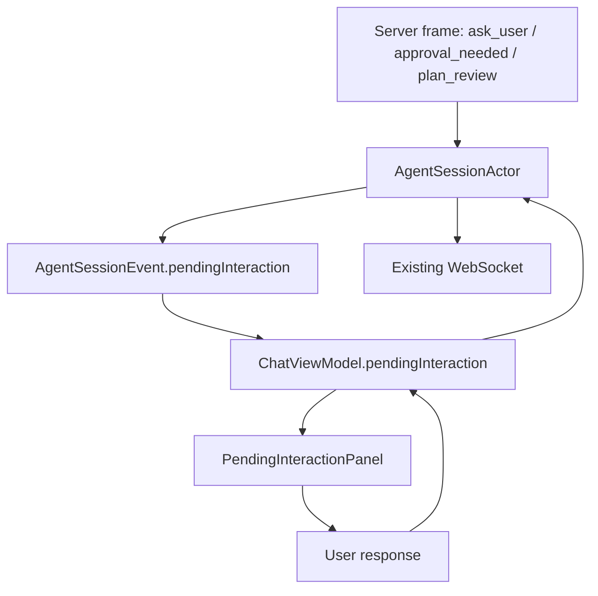
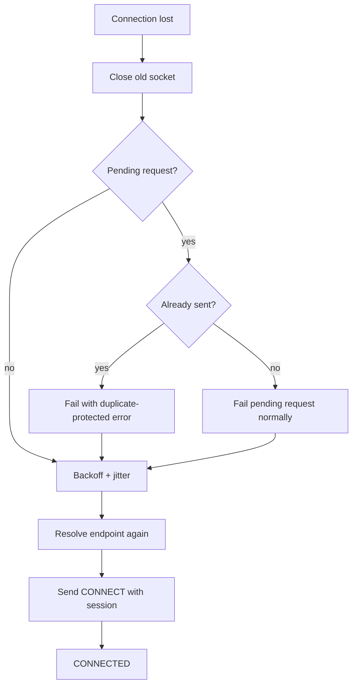

# OOChat iOS Hosted Agent 长连接运行时设计

## 1. 背景

OOChat iOS 当前需要和 Hosted Agent 通信。早期实现中，WebSocket 被当成一次性请求通道使用：

1. `connect()` 创建一个 WebSocket。
2. 发送 `CONNECT` frame。
3. 等到 `CONNECTED` 后返回。
4. 函数结束时关闭 socket。

发送消息时也是类似流程：

1. 创建 WebSocket。
2. 发送 `CONNECT`。
3. 等 `CONNECTED`。
4. 发送 `INPUT`。
5. 等 `OUTPUT`。
6. 关闭 socket。

这种方式实现简单，但它不是一个完整的会话运行时。它无法自然支持：

- 持续接收 agent 事件。
- 多轮消息复用同一个连接。
- `ask_user`、`approval_needed`、`plan_review` 等中间暂停态。
- 流式输出、工具调用事件、会话同步事件。
- 断线重连、网络切换、App 前后台切换。
- 对“请求已经发出但连接断开”的重复执行保护。

因此需要引入一个新的长连接运行时层，把 WebSocket 生命周期从单个函数中提升出来，成为一个可管理的会话对象。

## 2. 设计目标

本设计的核心目标是：

1. **复用 WebSocket 连接**
   同一个 agent + conversation 的连续消息应复用一个长连接，而不是每次发送都重新建连。

2. **把 socket 生命周期集中管理**
   连接、认证、收包、心跳、断线、重连、关闭都由运行时层负责，避免散落在 ViewModel 中。

3. **保留现有协议语义**
   继续使用现有的 `CONNECT`、`INPUT`、`PING`、`PONG`、`OUTPUT`、`ERROR` 等 frame，不要求服务端立刻改协议。

4. **保留会话恢复能力**
   继续通过 `session_id` 和 `serverSession` 恢复会话状态。

5. **支持交互式暂停态**
   `ask_user`、`approval_needed`、`plan_review`、`ulw_turns_reached`、`ONBOARD_REQUIRED` 不应被当作普通错误，而应被建模成 UI 可处理的 pending interaction。

6. **移动端友好**
   iOS 前后台切换、网络变化、系统挂起都要有明确策略。

7. **避免重复执行风险**
   如果 `INPUT` 已经发出，但连接在收到结果前断开，客户端不能盲目自动重发，除非服务端明确保证 `input_id` 幂等。

## 3. 非目标

第一版不做以下事情：

1. **不做一个 socket 复用多个 conversation 的 multiplex**
   当前设计采用一个 `(agentAddress, conversationID)` 对应一个长连接。这样最贴近现有协议，不依赖服务端在所有事件中都带完整 `session_id` 路由能力。

2. **不重写签名机制**
   仍然使用 `IdentityStore.signedEnvelope()` 对需要签名的 payload 做 Ed25519 签名。

3. **不实现完整 rich event UI**
   工具调用、LLM 调用、图片、文件等事件第一版可以先映射为普通聊天消息或 thinking 消息。后续可以升级成更细的 UI 组件。

4. **不在后台强行保持 WebSocket 常驻**
   iOS 后台长期 socket 不可靠。第一版策略是前台保持长连接，后台保存状态并允许断开，回前台恢复。

## 4. 总体架构

长连接设计新增一个运行时层。`ChatViewModel` 不直接持有 socket，而是通过 runtime 获取会话对象。



组件职责如下：

| 组件 | 职责 |
|---|---|
| `ChatViewModel` | 负责 UI 状态、conversation 更新、持久化映射、订阅 runtime 事件 |
| `AgentRuntimeManager` | 负责管理多个 `AgentSessionActor`，按 `SessionKey` 查找或创建 session |
| `AgentSessionActor` | 负责一个 conversation 的长连接生命周期、认证、收包循环、重连、pending request |
| `HostedAgentClient` | 负责协议细节：endpoint 解析、frame 构造、签名、send/read helper |
| `IdentityStore` | 负责 Ed25519 私钥存储、地址生成、签名 |
| `ConversationStore` | 负责本地 snapshot 持久化 |

## 5. SessionKey 设计

第一版使用如下 key：

```swift
struct SessionKey: Hashable {
    let agentAddress: String
    let conversationID: String
}
```

也就是说：

```text
一个 agent address + 一个 conversation id = 一个长连接 session
```

这样设计的原因：

1. `CONNECT` frame 当前天然绑定 `session_id`。
2. `Conversation` 自身持有 `serverSession` 和 `mode`。
3. 不要求服务端支持多会话消息路由。
4. 断线恢复时只需要恢复当前 conversation。

后续如果服务端协议稳定支持 multiplex，可以升级成：

```text
一个 agent address = 一个 socket
多个 conversation 通过 session_id 复用同一 socket
```

但这需要所有输入、输出、工具事件、交互事件都明确携带 `session_id`，并且客户端需要实现事件分发器。

## 6. 运行时状态机

`AgentSessionActor` 内部维护明确状态：

```swift
enum AgentRuntimeState {
    case idle
    case resolvingEndpoint
    case connecting
    case authenticating
    case connected
    case reconnecting(attempt: Int)
    case waiting
    case suspended
    case closing
    case closed
    case failed(String)
}
```

状态机如下：



状态会映射到 UI 层的 `ConnectionState`：

| Runtime 状态 | UI 状态 |
|---|---|
| `connected` | `connected` |
| `waiting` | `waiting` |
| `suspended` | `suspended` |
| `resolvingEndpoint` / `connecting` / `authenticating` / `reconnecting` | `reconnecting` |
| `idle` / `closed` / `failed` | `disconnected` |

## 7. 连接建立流程

连接建立由 `AgentSessionActor.ensureConnected()` 触发。



连接建立时会发送 `CONNECT` frame。它包含：

```text
type: CONNECT
payload:
  timestamp
  to
from
signature
timestamp
session_id
session
to  // relay 模式下顶层也带 to
```

其中：

- `payload` 由 `IdentityStore` 使用 Ed25519 签名。
- `session_id` 等于 `conversation.id`。
- `session` 来自 `conversation.serverSession`，并补齐 `session_id` 和 `mode`。

## 8. 发送 Prompt 流程

发送 prompt 时不再重新创建短连接，而是复用 session actor 内部的 socket。



`INPUT` frame 建议包含：

```text
type: INPUT
payload:
  prompt
  timestamp
  to       // relay 模式
from
signature
timestamp
input_id
session_id
prompt
to         // relay 模式顶层也带 to
```

这里的 `input_id` 是后续幂等、去重、错误恢复的关键字段。

## 9. Receive Loop 设计

长连接的核心是持续收包循环：

```swift
while !Task.isCancelled {
    let frame = try await client.readFrame(from: socket)
    await handleFrame(frame, from: socket)
}
```

每个 inbound frame 都会刷新 `lastFrameAt`。这样不只 `PING` 能证明连接活着，任何工具事件、流式事件、输出事件都能证明连接活着。

主要 frame 处理策略：

| frame type | 处理方式 |
|---|---|
| `PING` | 立即发送 `PONG` |
| `CONNECTED` | 标记 authenticated，完成 pending connect |
| `session_sync` | 更新 `serverSession` |
| `mode_changed` | 更新 session 中的 mode |
| `assistant` | 追加 agent 消息 |
| `thinking` / `llm_call` / `tool_call` | 追加 thinking 或状态消息 |
| `ask_user` | 进入 waiting，创建 `PendingInteraction` |
| `approval_needed` | 进入 waiting，创建 approval 类型 `PendingInteraction` |
| `plan_review` | 进入 waiting，创建 plan review 类型 `PendingInteraction` |
| `ulw_turns_reached` | 进入 waiting，创建 ULW 类型 `PendingInteraction` |
| `ONBOARD_REQUIRED` | 进入 waiting，暂停 connect timeout，等待用户输入 |
| `ONBOARD_SUCCESS` | 清理 onboarding UI，继续等 `CONNECTED` |
| `OUTPUT` | 完成 pending request |
| `ERROR` | 抛出真实服务端错误，关闭 socket，进入失败/重连路径 |

## 10. Pending Interaction 设计

以前 `ask_user` 被当成 error。长连接设计中，它是正常业务事件。

统一模型：

```swift
struct PendingInteraction {
    let id: String
    let conversationID: String
    let kind: PendingInteractionKind
    var title: String
    var message: String
    var options: [String]
    var tool: String?
    var argumentsText: String?
}
```

支持类型：

```swift
enum PendingInteractionKind {
    case askUser
    case approval
    case planReview
    case ulwTurnsReached
    case onboard
}
```

UI 策略：

- `askUser`：用户在输入框输入答案，发送 `ASK_USER_RESPONSE`。
- `approval`：UI 提供 Approve / Session / Reject 按钮，发送 `APPROVAL_RESPONSE`。
- `planReview`：用户在输入框输入反馈，发送 `PLAN_REVIEW_RESPONSE`。
- `ulwTurnsReached`：用户输入或选择继续/停止，发送 `ULW_RESPONSE`。
- `onboard`：用户输入 invite code，发送签名后的 `ONBOARD_SUBMIT`。



## 11. 断线重连设计

断线来源包括：

- WebSocket read 抛错。
- WebSocket 被服务端关闭。
- 60 秒没有收到任何 frame。
- 网络路径变化。
- App 从后台恢复时 socket 已不可用。

重连策略：

1. 关闭旧 socket。
2. 标记 `authenticated = false`。
3. 进入 `reconnecting(attempt)`。
4. 使用指数退避：

```text
1s, 2s, 4s, 8s, 16s, max 30s
```

5. 加少量 jitter，避免多个 session 同时重连。
6. 重新解析 endpoint。
7. 重新发送 `CONNECT`，带上原来的 `session_id` 和 `serverSession`。



## 12. 重复执行保护

最危险的场景是：

```text
客户端已经把 INPUT 发给服务端
但是还没收到 OUTPUT
连接断了
```

此时客户端不知道服务端是否已经开始执行该 input。

如果客户端自动重发，可能造成：

- 工具重复执行。
- 付费请求重复执行。
- 文件写入重复发生。
- Agent 任务状态混乱。

因此第一版采用保守策略：

| pending request 状态 | 断线后策略 |
|---|---|
| 尚未发出 | 可以失败并允许用户重试 |
| 已经发出 | 不自动重发，返回 duplicate-protected 错误 |
| 服务端明确返回 `ERROR` | 返回真实服务端错误 |
| 服务端返回 `OUTPUT` | 正常完成 |
| 服务端返回 waiting event | 正常进入 pending interaction |

未来如果服务端明确支持 `input_id` 幂等，可以升级成：

```text
重连后查询 input_id 状态
如果服务端未收到，则重发
如果服务端已收到，则等待或拉取结果
如果服务端已完成，则直接恢复 OUTPUT
```

## 13. 心跳和静默检测

服务端会发送 `PING`，客户端回复：

```json
{ "type": "PONG" }
```

除此之外，客户端维护：

```swift
lastFrameAt: Date
```

策略：

- 收到任何 frame 都更新 `lastFrameAt`。
- 每 15 秒检查一次。
- 如果 60 秒没有收到任何 frame，认为连接不可用。
- 主动关闭 socket 并进入重连。

这样可以处理 TCP 半开、网络切换后 socket 表面未关闭但实际不可用的情况。

## 14. iOS 前后台策略

iOS 上不能假设后台 WebSocket 长期稳定。因此策略是：

| App 状态 | 策略 |
|---|---|
| active | 保持或恢复长连接 |
| inactive | 不主动动作 |
| background | suspend runtime，关闭 socket，保存会话状态 |
| 回到 active | 使用 `session_id` + `serverSession` 重新连接 |

SwiftUI 通过 `ScenePhase` 通知 `ChatViewModel`：

```swift
func handleScenePhase(_ phase: ScenePhase)
```

然后转发给 runtime：

```text
active     -> runtime.resumeAll()
background -> runtime.suspendAll()
```

## 15. 网络变化策略

使用 `NWPathMonitor` 监听网络状态。

| 网络状态 | 策略 |
|---|---|
| satisfied | 尝试恢复所有 session |
| unsatisfied | 标记网络不可用，关闭 socket，UI 显示 disconnected |

网络恢复后不复用旧 socket，而是重新 endpoint discovery。原因是 agent 的 direct endpoint、relay 状态、设备网络路径都可能已经变化。

## 16. Endpoint Discovery 策略

继续复用原有顺序：

1. Probe 本地：

```text
http://localhost:8000/info
http://127.0.0.1:8000/info
```

2. 查询 relay registry：

```text
https://oo.openonion.ai/api/relay/agents/{agentAddress}
```

3. 对 relay 返回的 endpoints 按距离排序：

```text
localhost / 127.0.0.1
局域网 IP
公网 endpoint
```

4. 逐个 probe direct endpoint。

5. direct 不可用时 fallback 到：

```text
wss://oo.openonion.ai/ws/input
```

每次重连都重新解析 endpoint，避免一直绑定到已经失效的路径。

## 17. 安全与签名

签名继续由 `IdentityStore` 负责：

```swift
func signedEnvelope(type: String, payload: [String: JSONValue]) throws -> [String: JSONValue]
```

签名流程：

1. 从 Keychain 读取 Ed25519 private key。
2. 如果不存在则生成并保存。
3. 使用 canonical JSON 编码 payload。
4. 用私钥签名 payload。
5. 返回 envelope：

```text
type
payload
from
signature
timestamp
```

长连接不会削弱签名要求：

- `CONNECT` 仍然签名。
- `INPUT` 仍然签名。
- `ONBOARD_SUBMIT` 仍然签名。
- 普通 response frame 可以按协议需求决定是否签名。

## 18. 数据持久化

本地持久化仍由 `ConversationStore` 管理。

运行时不直接写 `UserDefaults`。它只发事件：

```swift
enum AgentSessionEvent {
    case stateChanged(SessionKey, AgentRuntimeState)
    case serverSessionUpdated(SessionKey, [String: JSONValue])
    case message(SessionKey, ChatMessage)
    case pendingInteraction(SessionKey, PendingInteraction?)
}
```

`ChatViewModel` 收到事件后：

1. 更新对应 conversation。
2. 合并 `serverSession`。
3. 更新 UI 状态。
4. 调用 `ConversationStore.save()`。

这样 runtime 层不依赖 UI，也不依赖具体持久化实现。

## 19. Conversation 与 Runtime 的边界

`Conversation` 是持久化模型，保存长期状态：

- `id`
- `agentID`
- `agentAddress`
- `mode`
- `messages`
- `serverSession`

`AgentSessionActor` 是运行时模型，保存临时状态：

- socket
- receive task
- health task
- reconnect task
- authenticated
- pending request
- endpoint
- lastFrameAt

这两个模型不能混在一起。原因是：

- `Conversation` 可以跨 App 重启存在。
- `AgentSessionActor` 只在进程运行期间存在。
- socket 和 task 不应该进入持久化层。

## 20. UI 集成策略

UI 不直接知道 socket。

`ChatViewModel` 暴露：

```swift
@Published var connectionState: ConnectionState
@Published var isConnecting: Bool
@Published var isProcessing: Bool
@Published var pendingInteraction: PendingInteraction?
@Published var conversations: [Conversation]
```

聊天页根据这些状态渲染：

- 顶部 status pill：`connected` / `reconnecting` / `waiting` / `suspended` / `disconnected`
- 消息列表：来自 conversation messages
- 输入框：普通 prompt 或 pending interaction 回复
- `PendingInteractionPanel`：显示 ask_user、approval、plan review、onboarding 等等待态

## 21. 错误处理原则

错误分三类：

### 21.1 本地输入错误

例如 agent address 格式错误。直接在 ViewModel 层阻止请求：

```text
Enter a hosted agent address in 0x-prefixed Ed25519 format.
```

### 21.2 服务端明确错误

收到 `ERROR` frame，使用服务端返回的 message/error/result/content。

这种错误不走 duplicate-protection，因为服务端已经明确回复。

### 21.3 连接异常

包括 socket close、读写失败、超时、网络断开。

如果请求已经发出，则返回 duplicate-protected 错误：

```text
The connection dropped after the request was sent.
It was not retried to avoid duplicate execution.
```

如果请求尚未发出，可以普通失败并允许用户重试。

## 22. 为什么不用 ViewModel 直接持有 WebSocket

不推荐这样做：

```text
ChatViewModel
  -> socket
  -> receive loop
  -> reconnect timer
  -> pending request
  -> scene phase
  -> network monitor
  -> persistence
```

原因：

1. ViewModel 会变成上帝对象。
2. socket 生命周期和 UI 生命周期耦合过深。
3. 多 conversation 时状态会互相污染。
4. 测试和调试困难。
5. 后续如果要抽 SDK，ViewModel 里的逻辑无法复用。

更好的边界是：

```text
ViewModel 负责 UI 状态映射
Runtime 负责连接生命周期
HostedAgentClient 负责协议 frame
```

## 23. 当前第一版文件分工

| 文件 | 变化 |
|---|---|
| `OOChatIOS/Core/Protocol/AgentRuntime.swift` | 新增长连接运行时，包含 `AgentRuntimeManager` 和 `AgentSessionActor` |
| `OOChatIOS/Core/Protocol/HostedAgentClient.swift` | 暴露 endpoint 解析、frame 构造、send/read helper，继续负责协议细节 |
| `OOChatIOS/Features/Chat/ChatViewModel.swift` | 改为调用 runtime，订阅 runtime events，处理 pending interaction 和生命周期 |
| `OOChatIOS/Core/Models/Models.swift` | 增加 `waiting` / `suspended` 状态，增加 `PendingInteraction` 和 `HostedAgentResult.done` |
| `OOChatIOS/App/ContentView.swift` | 增加 scene phase 转发和 pending interaction UI |

## 24. 后续演进方向

### 24.1 支持服务端幂等查询

增加：

```text
INPUT_STATUS(input_id)
```

或者：

```text
SESSION_STATUS(session_id)
```

用于判断断线前的 input 是否已经执行。

### 24.2 支持真正 streaming UI

当前可以先把 streaming event 映射成普通消息。后续可以建立更完整的 UI item 模型：

```text
tool_call
tool_result
llm_call
llm_result
assistant_delta
assistant_done
files_received
agent_image
```

### 24.3 支持 agent-level multiplex

未来可以升级为：

```text
一个 agentAddress 一个 socket
多个 conversation 通过 session_id 分发
```

前提是服务端所有事件都带 `session_id`，客户端 runtime 有可靠 demux。

### 24.4 抽出平台无关 SDK Core

长期目标可以是：

```text
AgentSession Core
  -> SwiftUI adapter
  -> UIKit adapter
  -> React Native adapter
```

这样协议、重连、pending interaction、session sync 可以跨端复用。

## 25. 手动验证清单

不在本文中要求自动测试，但手动测试时建议覆盖：

1. 输入非法 agent address，确认不会发起连接。
2. 输入有效 agent address，确认可以连接并保持 `connected`。
3. 连续发送两条 prompt，确认第二条复用同一个 runtime session。
4. 服务端返回 `PING`，客户端能回 `PONG`。
5. 服务端返回 `OUTPUT`，UI 移除 transient thinking 并显示回复。
6. 服务端返回 `ask_user`，UI 进入 `waiting`，输入框变为回复。
7. 服务端返回 `approval_needed`，UI 显示 Approve / Session / Reject。
8. App 进入后台后，状态进入 `suspended` 或连接被关闭。
9. App 回前台后，使用 `session_id` 和 `serverSession` 恢复。
10. 网络断开后，socket 关闭并显示 disconnected/reconnecting。
11. 网络恢复后，runtime 重新 endpoint discovery 并重连。
12. `INPUT` 发出后强制断网，确认不会自动重发造成重复执行。

## 26. 总结

这次设计的核心不是“把 WebSocket 变量保存成成员变量”，而是引入一个完整的长连接运行时：

```text
AgentRuntimeManager 管 session
AgentSessionActor 管 socket 生命周期
HostedAgentClient 管协议 frame
ChatViewModel 管 UI 状态和持久化映射
```

第一版选择一个 conversation 一个长连接，是为了贴合当前 `session_id` 协议，避免过早引入 multiplex 复杂度。这样可以先获得长连接、重连、前后台恢复、pending interaction 和重复执行保护，同时给后续 streaming UI、幂等恢复、多会话复用留下清晰演进路径。
